## 🧑‍💻 About

- 🏫 Incoming PhD @ **Sun Yat-sen University**, School of Intelligent Systems Engineering
- 🔬 Research interests: Autonomous Driving · Large Language Models · Computer Vision · Deep Learning
- 🏸 Badminton enthusiast with professional training
- 🌱 Currently exploring multi-modal perception for autonomous driving and world models

## 📊 GitHub Stats

<table align="center">
  <tr>
    <td>
      
    </td>
    <td>
      
    </td>
  </tr>
</table>

## 🛠️ Tech & Projects

<table align="center">
  <tr>
    <td>
      
    </td>
    <td>
      
    </td>
  </tr>
</table>

  

 

**✨ *"Live life to the fullest."* ✨**

 

