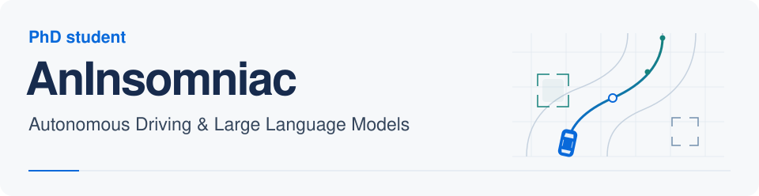

<picture>
  <source media="(max-width: 600px) and (prefers-color-scheme: dark)" srcset="./assets/header-mobile-dark.svg">
  <source media="(max-width: 600px)" srcset="./assets/header-mobile-light.svg">
  <source media="(prefers-color-scheme: dark)" srcset="./assets/header-dark.svg">
  
</picture>

[qq1326555262@gmail.com](mailto:qq1326555262@gmail.com)

## About

- PhD student at **Sun Yat-sen University**, School of Intelligent Systems Engineering.
- Researching **autonomous driving and large language models**, with a current emphasis on vision-language-action (VLA) models for autonomous driving.
- Also exploring agents and world models.
- 🏸 Badminton enthusiast with professional training.
- 🥊 Also trained in sanda and boxing.

## Selected projects

**[motrix-next](https://github.com/AnInsomniacy/motrix-next)** 
A full-featured download manager, rebuilt from the ground up.

**[tracknet-series-pytorch](https://github.com/AnInsomniacy/tracknet-series-pytorch)** 
Tracking small, fast-moving objects in sports videos with PyTorch.

**Tools:** Docker, TensorFlow, PyTorch, OpenCV, Kubernetes.

## GitHub

  <picture>
    <source media="(prefers-color-scheme: dark)" srcset="./assets/stats-dark.svg">
    
  </picture>
  <picture>
    <source media="(prefers-color-scheme: dark)" srcset="./assets/languages-dark.svg">
    
  </picture>

*Live life to the fullest.*

[Sponsor](./SPONSOR.md)
